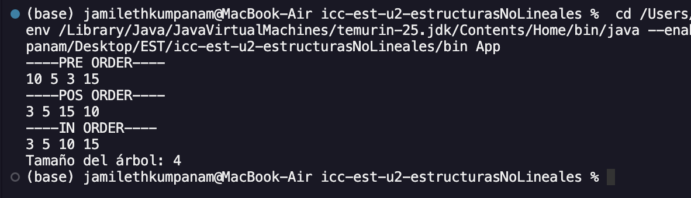
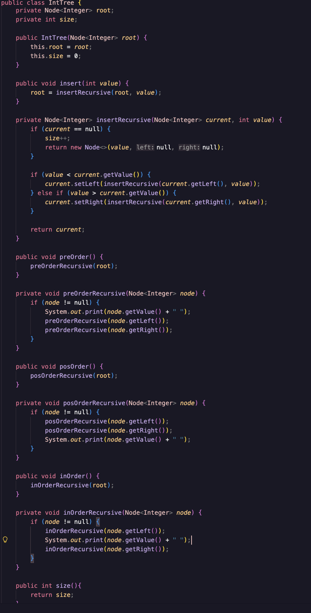
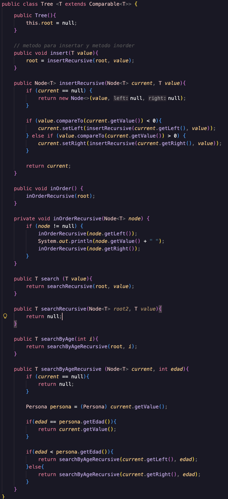
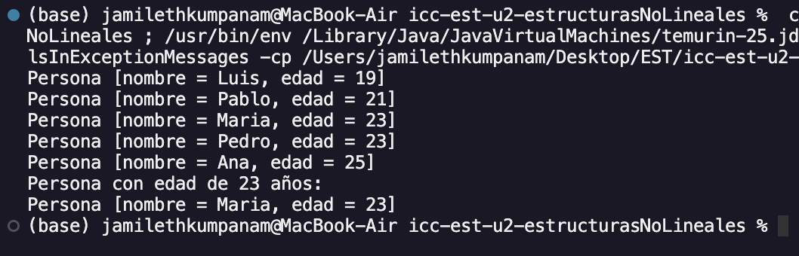
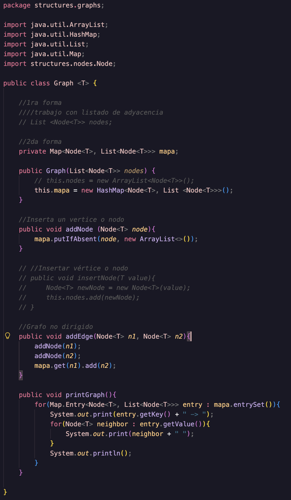
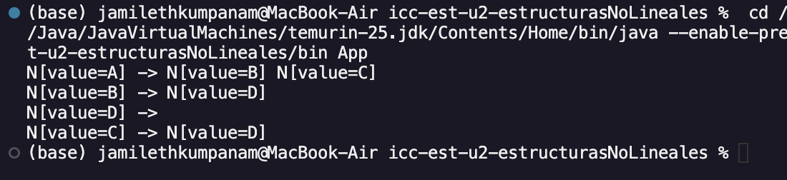
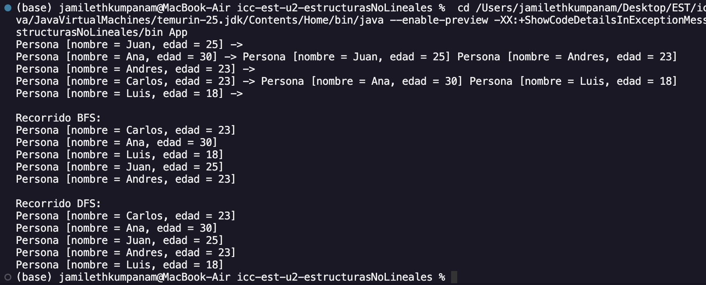

# Práctica: Práctica de Árboles – Implementación Integers

## Autor
- Nombre: Jamileth Kumpanam
- Carrera/Curso: ESTRUCTURA DE DATOS GRUPO - 1 - COMPUTACIÓN

##  Nombre de la práctica - Fecha
- Práctica: Práctica de Árboles – Implementación Integers
- Fecha: 2026-01-05

## Descripción
Implementar un Árbol Binario de Búsqueda para enteros con recorridos PreOrder, InOrder, PostOrder y un método size() que retorne el total de nodos en complejidad O(1).

El árbol debe permitir inserción de enteros.

Debe imprimir en consola los tres recorridos:

PreOrder

InOrder

PostOrder

Debe imprimir en consola el tamaño del árbol.

size() debe ser O(1). Para cumplirlo, el árbol debe mantener un contador interno (ej. private int size;) que se actualice en insert.

## Evidencias
### Captura 1
Aquí se muestra la ejecución del código O(n) en los recorridos y O(1) en el size al crear una variable

### Captura 2 
Código de como hacer el size O(1) con una variable variable

# Práctica 2: Práctica de Árboles – Implementación Genéricos uso de interfaces Comparable

## Autor
- Nombre: Jamileth Kumpanam
- Carrera/Curso: ESTRUCTURA DE DATOS GRUPO - 1 - COMPUTACIÓN

##  Nombre de la práctica - Fecha
- Práctica: Práctica de Árboles – Implementación Genéricos uso de interfaces Comparable
- Fecha: 2026-01-06

## Descripción
Implementar un Árbol Binario de Búsqueda genérico en Java usando:

Node<T>
Tree<T>
Object implements Comparable<Object>
El criterio de ordenamiento no se impone en la clase Tree, sino en los objetos almacenados, cuando estos implementan la interfaz Comparable.

### Requisitos técnicos
Implementar la clase genérica:

class Tree<T>

Implementar la clase:

class Node<T>
El árbol debe permitir inserción de elementos de tipo T.

El ordenamiento debe realizarse mediante casting a Comparable dentro del árbol.

Implementar e imprimir en consola los recorridos:

InOrder
Implementaciones obligatorias
Implementación con objetos Persona
Crear la clase:

public class Persona implements Comparable<Persona>
La comparación debe basarse en el atributo edad

Usar la misma clase:

Tree<Persona>
#### Mostrar en consola:

InOrder

## Evidencias
### Captura 1
La clase Tree<T> implementa un árbol binario de búsqueda genérico en Java. Los elementos almacenados deben implementar Comparable para mantener el orden del árbol.

Incluye métodos para:

* Insertar elementos de forma recursiva.

* Recorrer el árbol en orden inorden.

* Buscar elementos dentro del árbol.

* Buscar una persona por edad, asumiendo que el árbol almacena objetos Persona.

* El árbol organiza los valores menores a la izquierda y los mayores a la derecha.

### Captura 2 
Captura del método InOrder

Captura del resultado de la busqueda en consola de una persona por edad.

# Práctica 3: Práctica de Graphs

## Autor
- Nombre: Jamileth Kumpanam
- Carrera/Curso: ESTRUCTURA DE DATOS GRUPO - 1 - COMPUTACIÓN

##  Nombre de la práctica - Fecha
- Práctica: Práctica de Graphs
- Fecha: 2026-08-06

## Descripción
Implementar un Grafo  en Java usando:

Node<T>
Graph<T>
### Requisitos técnicos
Implementar la clase genérica:

class Graph<T>
Implementar la clase:

class Node<T>
 
Implementaciones obligatorias
Implementación con objetos StringI

## Evidencias
### Captura 1

### Captura 2 

### Captura 3

